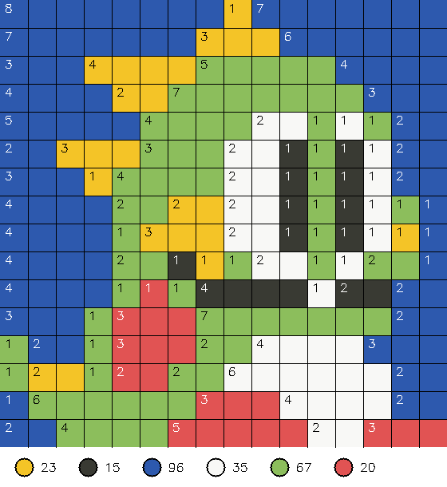

# pixelart
Utilities for my pixelart projects.

# Getting started

1. Install dependencies
```
pip install opencv-python numpy scikit-learn termcolor
```

2. You are already ready to run the scripts in ./scripts


# Scripts

## pixelize
### Usage
```
python ./scripts/pixelize.py ./path/to/input-image.jpg k
```
Make sure your `./path/to/input-image.jpg` is a square pixelart image. `k` is the number of different colors in your image.


### Output
The command identifies the pixels in your input image and outputs the number of pixels by color into the console.

Additionally, two output images are generated:
1. `out.jpg`, a true 16x16 pixel image based on what was detected in your input image.


2. `out-scaled.jpg`, a scaled up version of the detected image with UI enhancements to make it easier to draw or build the image. A black grid makes it easier to detect pixel boundaries, a legend shows the pixel color count output (same as in console), and the length of a same-color sequence is indicated by a number in its first field (by row).
